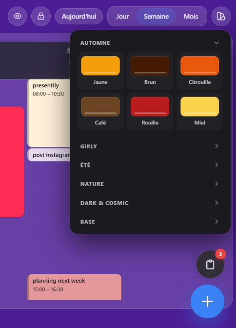
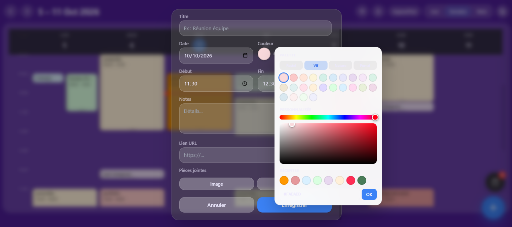
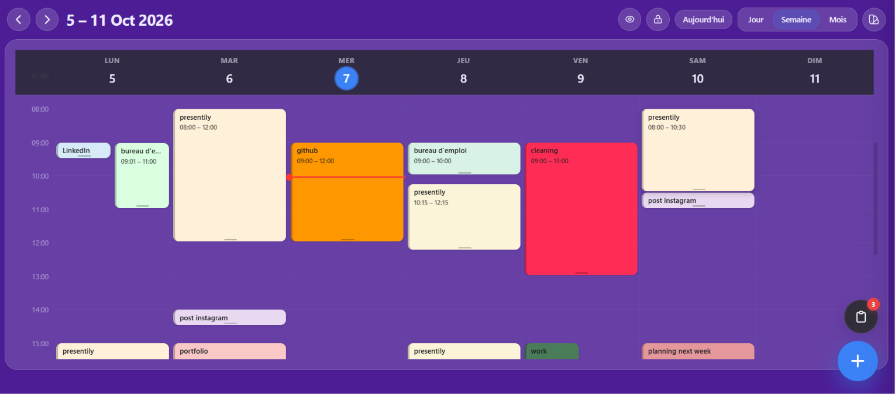

# iOS Style Planner 

> **A minimalist planner inspired by the iOS design language.**

iOS Style Planner is a lightweight web-based planner designed with a clean, minimal and modern interface inspired by the visual language of iOS.

The project focuses on **simplicity, usability and a polished user experience** without unnecessary complexity.

---

##  Overview

The goal of this project is to create a simple planner interface that feels familiar to users of modern mobile productivity applications.

The design focuses on:

*  Clean and minimal UI
*  iOS-inspired visual language
*  Simple navigation and interactions
*  Responsive web experience
*  Lightweight implementation
*  Focus on usability

---

##  Project Goals

This project was created to explore how a familiar mobile-inspired design approach can be translated into a web application.

The main objectives are:

* Build a clean and intuitive planner interface
* Recreate an iOS-inspired visual experience for the web
* Practice frontend development
* Explore modern UI design principles
* Focus on spacing, typography and visual hierarchy
* Create a simple and accessible user experience

---

##  Technologies

The project is intentionally lightweight and currently consists of a single HTML entry point.

* **HTML5**
* **CSS3**
* **JavaScript**
* **Responsive Web Design**

---

## 📸 Screenshots

###  Themes

Different visual themes are available to personalize the planner experience.

<p align="center">
  
</p>

---

###  Add Task

A simple and intuitive interface for creating and organizing tasks.

<p align="center">
  
</p>

---

###  Weekly Planner

A weekly view designed to help users visualize and organize their schedule.

<p align="center">
  
</p>

---

##  Project Structure

```text
ios-style-planner/
│
├── index.html
├── README.md
│
└── screenshots/
    ├── themes.png
    ├── add-task.png
    └── weekly-planner.png
```

---

##  Getting Started

No installation or build process is required.

### 1. Clone the repository

```bash
git clone https://github.com/fadwadhmaid/ios-style-planner.git
```

### 2. Open the project

```bash
cd ios-style-planner
```

### 3. Run the application

Simply open `index.html` in your browser.

You can also use a local development server such as **VS Code Live Server**.

---

##  Design Inspiration

The interface takes inspiration from design principles commonly associated with Apple's iOS ecosystem:

* Minimalism
* Clear visual hierarchy
* Rounded interfaces
* Generous spacing
* Simple interactions
* Focus on content
* Mobile-oriented user experience

The project is an independent design and development project and is **not affiliated with or endorsed by Apple Inc.**

---

##  Responsive Design

The planner is designed as a web interface with a mobile-inspired experience while remaining suitable for modern desktop and mobile browsers.

The interface focuses on maintaining a clean layout and accessible interactions across different screen sizes.

---

##  Future Improvements

Possible future improvements include:

* Persistent task storage
* Advanced task creation and editing
* Calendar integration
* Categories and priorities
* Dark mode
* Notifications and reminders
* Local storage or database integration
* Improved mobile interactions
* Progressive Web App (PWA) support
* Additional planner views

---

##  Project Status

 **Active personal project**

The current version focuses on the planner interface, visual experience and core frontend interactions.

The project may evolve with additional productivity features and UI improvements.

---

##  Author

**Fadwa Dhmaid**

Software Engineer & AI Developer

* GitHub: [@fadwadhmaid](https://github.com/fadwadhmaid)
* Website: [foryouusis.netlify.app](https://foryouusis.netlify.app/)

---

##  License

This project is currently developed as a personal project.

---

 **If you like the project, feel free to explore the repository and follow its development.**
